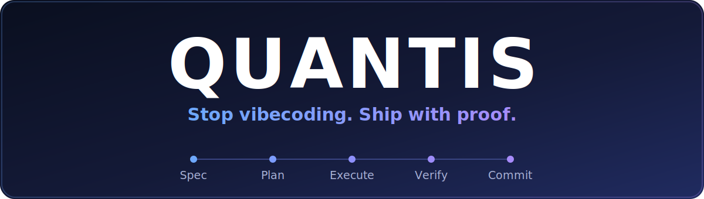
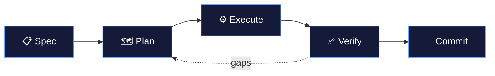

<div align="center">



<br/>
<br/>


**Spec-driven development for AI coding agents.**

Persistent memory across sessions · battle-tested code-quality skills · a real **discuss → plan → execute → verify** workflow.

[Quick Start](#quick-start) · [How It Works](#how-it-works) · [Architecture](#architecture) · [Commands](#commands) · [Platforms](#platforms)

</div>

---

Quantis turns AI-assisted coding from *vibecoding* into a structured, repeatable process. It gives your AI agent persistent memory across sessions, forks [obra/superpowers](https://github.com/obra/superpowers)' battle-tested code-quality skills, and wraps them in a project-management workflow that runs natively on [Google Antigravity](https://blog.google/technology/google-deepmind/antigravity/).

> **No "trust me, it works."** Every phase ends in empirical verification — commands run, output read, proof recorded.

<a id="quick-start"></a>

## 🚀 Quick Start

### 1 · Install

Run this one-liner in your target project directory:

```bash
curl -sSL https://raw.githubusercontent.com/ppm98dev/Coding-Workflow/main/scripts/install.sh | bash
```

### 2 · Initialize

Start the Antigravity CLI (`agy` — the primary platform) and tell your agent:

```
/wf-new-project   →  Deep questioning to create SPEC.md
/wf-plan 1        →  Decompose Phase 1 into executable plans
/wf-execute 1     →  Implement Phase 1 (with real subagents)
/wf-verify 1      →  Prove it works with evidence
```

> 🔤 **Command prefix:** On the CLI (`agy`) commands use the `/wf-` prefix. In the Antigravity **IDE / Standalone**, drop it — `/new-project`, `/plan 1`, `/execute 1`. See [Platforms](#platforms).

<details>
<summary><b>Already installed?</b></summary>

<br/>

| Command | Purpose |
|---------|---------|
| `/wf-install` | Reinstall Quantis from GitHub |
| `/wf-update` | Incremental update to the latest version |
| `/wf-upgrade` | Migrate from GSD v2.x → Quantis |

</details>

---

<a id="how-it-works"></a>

## 🔄 How It Works

Quantis is a loop. Each phase produces a durable artifact in `.quantis/`, and nothing advances on vibes — gaps route back to planning.



| Stage | Skill | Output |
|-------|-------|--------|
| 📋 **Spec** | `brainstorming` | `SPEC.md` (FINALIZED before any code) |
| 🗺️ **Plan** | `writing-plans` | checkbox plans, one task per file |
| ⚙️ **Execute** | `subagent-driven-development` | code + tests, TDD per task |
| ✅ **Verify** | `verification-before-completion` | `VERIFICATION.md` with empirical proof |

### 🛡️ Core Rules

> 🔒 **Planning Lock** — no code until `SPEC.md` is FINALIZED
> 💾 **State Persistence** — `STATE.md` updated after every task
> 🧹 **Context Hygiene** — 3 failures → state dump → fresh session
> ✅ **Empirical Validation** — proof required, never "trust me, it works"

---

<a id="architecture"></a>

## 🧩 Architecture

Three layers: **skills** do the methodology, **workflows** run the process, **state** is the memory.

### 🧠 Skills (18) — the methodology engine

Auto-triggered skills that fire on task context. Powered by [obra/superpowers](https://github.com/obra/superpowers) v5.1.0.

| Category | Skills |
|----------|--------|
| **Code Quality** | subagent-driven-development · test-driven-development · requesting-code-review · receiving-code-review |
| **Planning** | brainstorming · writing-plans · executing-plans |
| **Debugging** | systematic-debugging · verification-before-completion |
| **Context** | codebase-mapper · context-compressor · context-health-monitor · token-budget |
| **Git** | using-git-worktrees · finishing-a-development-branch |
| **Meta** | writing-skills · dispatching-parallel-agents · using-quantis |

### ⚡ Workflows (30) — project management

Slash commands for orchestration. See the [full command reference](#commands) below.

> 🔌 **Ecosystem Discovery:** `/wf-plan` auto-detects custom skills (from [skills.sh](https://www.skills.sh)) and active MCP servers, injecting them into the planning context.

### 💾 State (`.quantis/`) — persistent memory

| File | Purpose |
|------|---------|
| `SPEC.md` | Requirements (FINALIZED before coding) |
| `ROADMAP.md` | Phases, milestones, progress |
| `STATE.md` | Current position, session handoffs |
| `JOURNAL.md` | Session logs & decisions |
| `DECISIONS.md` | Architectural decisions |
| `phases/` | Isolated subphase folders (e.g. `1.1-user-auth/`) — specs, plans, reports |

---

<a id="commands"></a>

## ⌨️ Commands

Command names are shown in their logical form. On the CLI (`agy`) prefix each with `/wf-` (e.g. `/wf-plan`); the IDE and Standalone use them bare.

**Core lifecycle**

| Command | Purpose |
|---------|---------|
| `/new-project` | Initialize with deep questioning → SPEC.md |
| `/plan [N]` | Decompose requirements into executable phase plans |
| `/execute [N]` | Execute a phase with focused context |
| `/verify [N]` | Validate work against spec with empirical evidence |
| `/debug-issue` | Systematic debugging with persistent state |
| `/complete-milestone` | Archive milestone and prepare for next |

<details>
<summary><b>Planning &amp; research</b></summary>

| Command | Purpose |
|---------|---------|
| `/discuss-phase` | Clarify scope and approach before planning |
| `/research-phase` | Deep technical research for a phase |
| `/stress-test` | Adversarial spec review — find ambiguity and gaps |
| `/update-plan` | Revise plans based on discussion |
| `/plan-milestone-gaps` | Create plans to address gaps found in audit |
| `/list-phase-assumptions` | List assumptions made during planning |

</details>

<details>
<summary><b>Roadmap management</b></summary>

| Command | Purpose |
|---------|---------|
| `/new-milestone` | Create a new milestone with phases |
| `/add-phase` | Add a phase to the end of the roadmap |
| `/insert-phase` | Insert a phase between existing phases |
| `/remove-phase` | Remove a phase (with safety checks) |
| `/audit-milestone` | Audit a milestone for quality and completeness |

</details>

<details>
<summary><b>Session &amp; state</b></summary>

| Command | Purpose |
|---------|---------|
| `/pause` | Dump state for clean session handoff |
| `/resume-session` | Restore context from previous session |
| `/progress` | Show current position in roadmap |
| `/map` | Analyze codebase → ARCHITECTURE.md + STACK.md |
| `/sprint` | Time-boxed sprint for quick focused work |
| `/add-todo` · `/check-todos` | Task capture and review |

</details>

<details>
<summary><b>Package management</b></summary>

| Command | Purpose |
|---------|---------|
| `/install` | Install Quantis from GitHub |
| `/update` | Update to latest version |
| `/upgrade` | Migrate from GSD v2.x → Quantis |
| `/whats-new` | Show recent changes and features |
| `/web-search` | Search the web to inform decisions |
| `/quantis-help` | Show all available commands |

</details>

---

<a id="platforms"></a>

## 🖥️ Platforms

| Platform | Command prefix | Subagents | Browser |
|----------|:--------------:|:---------:|:-------:|
| **Antigravity CLI** (`agy`) — *primary* | `/wf-command` | ✅ `invoke_subagent` | ❌ |
| **Antigravity IDE** | `/command` | ❌ inline | ✅ `browser_subagent` |
| **Standalone** (Antigravity 2.0) | `/command` | ✅ `invoke_subagent` | ✅ `/browser` |

All workflows and skills live in `.agents/skills/` — no platform-specific setup after install. Workflows detect capabilities at runtime; on `agy`, `/wf-execute` dispatches **real subagents** (implementer + reviewers), each loading its methodology skill by path.

<details>
<summary><b>Repository layout</b></summary>

```
.agents/
├── skills/       30 workflow commands (wf-*) + 18 auto-triggered skills
└── rules/        PROJECT_RULES.md · CONSTITUTION.md · QUANTIS-STYLE.md
.gemini/          Platform bootstrap
.quantis/         Project state, templates + VERSION (Quantis version marker)
adapters/         Platform-specific guidance
scripts/          Validation scripts + one-liner installer
assets/           README banner
CHANGELOG.md      Release history
MANIFEST.md       Core file listing (for safe updates)
```

</details>

---

## 🙏 Credits

- 💡 **Inspiration** — [Get Shit Done for Antigravity](https://github.com/toonight/get-shit-done-for-antigravity) (GSD) — the spec-driven, *"stop vibecoding"* workflow that sparked Quantis (our tagline is a grateful riff on theirs)
- 🧠 **Skills engine** — [obra/superpowers](https://github.com/obra/superpowers) v5.1.0 (TDD, SDD, code review, debugging)
- 🔄 **Methodology & orchestration** — Quantis (project management, state persistence, workflow layer)
- 🚀 **Platform** — [Google Antigravity](https://blog.google/technology/google-deepmind/antigravity/)

<div align="center">

<br/>

**Stop vibecoding. Ship with proof.**

`MIT License`

</div>
